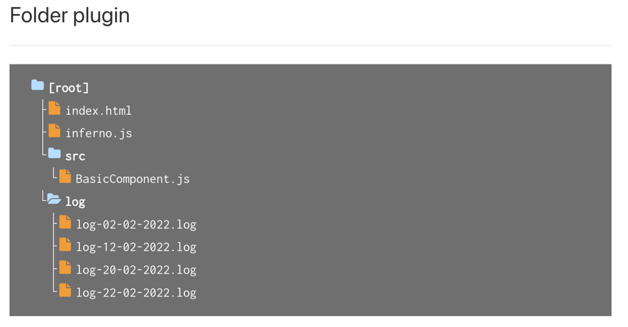

# README

## What is in this package?

This package contains the `docsify-folderizer` plugin.

The `docsify-folderizer` plugin is an easy way to present folder structures in a nice graphical way.

It works with **folders**, **files** and indented trees. To a certain extend it is quite flexible too and
a lot of parameters can be modified, like for example the icon colors. 

## Fontawesome 

This plugin comes with its own subset of [Fontawesome](https://www.fontawesome.com) icons, but are created with the web application of [Fontastic](https://app.fontastic.me/). 
It is an excerpt of the Fontawesome icons. You can define your own icon set as well. Small modification to the css is required however.

## Requirements

This plugin requires a [Docsify](//docsify.js.org/#/?id=docsify) installation.

## Documentation and Samples

[Documentation](//enovision.github.io/docsify-folderizer/#/)